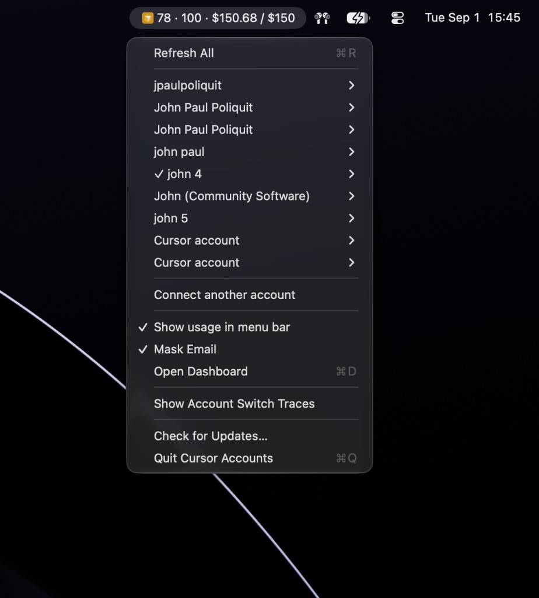
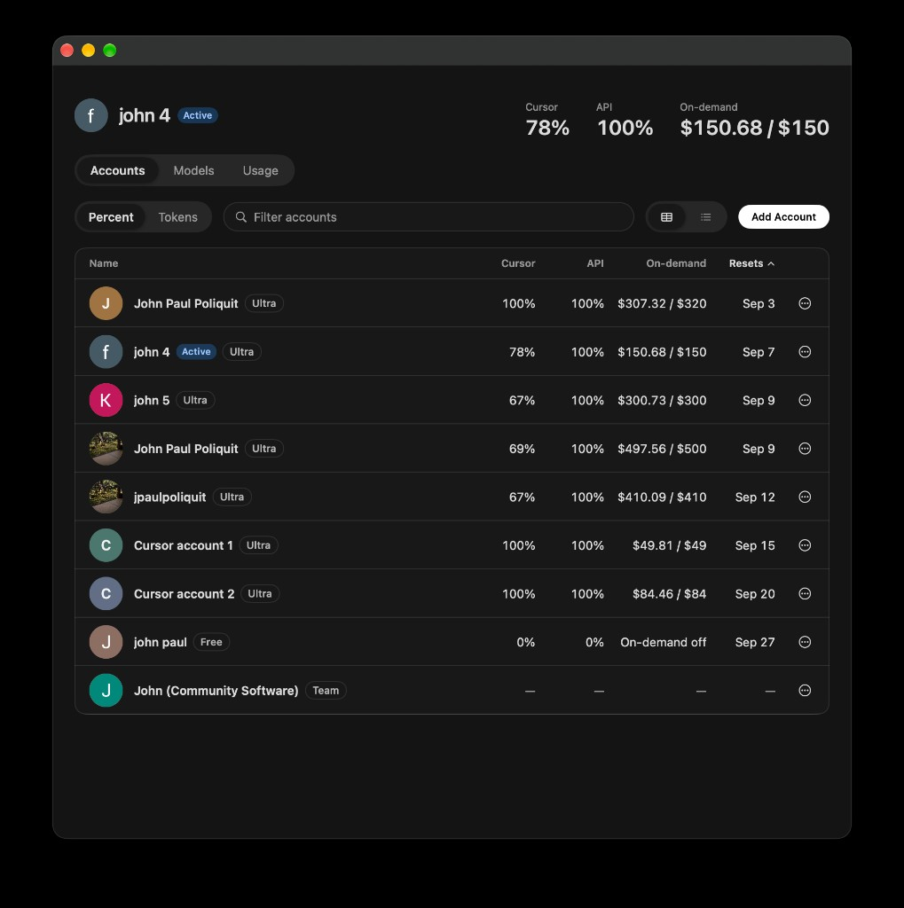
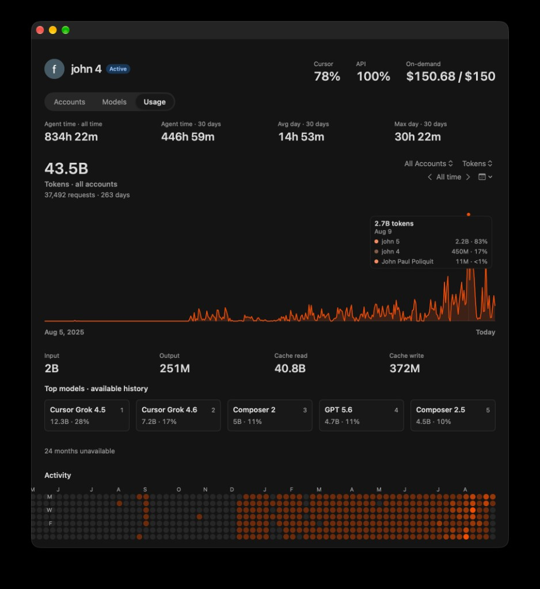

# Cursor Accounts

Switch between multiple Cursor accounts without signing in and out every time.

Cursor normally keeps one account signed in at a time. Cursor Accounts is a macOS 14+ menu-bar app that keeps your accounts together and switches Cursor between them for you.

It also shows usage, reset dates, and optional labels so you can tell accounts apart. You need Cursor installed.

## Install

### Download the app


1. Download `Cursor-Accounts-*.dmg` from the [latest release](https://github.com/jpaulpoliquit/cursor-accounts/releases/latest).
2. Drag Cursor Accounts into Applications.
3. Open it from Applications.

### Allow it on first launch

macOS may block the app the first time you open it because this build is Apple Development signed but not notarized.

1. Open **System Settings → Privacy & Security**.
2. Find **"Cursor Accounts.app" was blocked to protect your Mac**.
3. Click **Open Anyway**.
4. When macOS asks again, click **Open Anyway**.

Do not choose Move to Trash.

Open Cursor Accounts again from Applications.

It runs from the menu bar as a small yellow Cursor mark. There is no permanent Dock icon. The Dock icon only appears while the dashboard is open.

### Install from source

```bash
brew install xcodegen
./Scripts/install.sh
```

This installs:

- `Cursor Accounts.app` in `/Applications`
- `cursor-accounts` on your PATH

Open a new terminal before using the CLI.

## Using Cursor Accounts

### Connect accounts

Click the yellow Cursor mark in the menu bar.

For your first account, choose **Connect Cursor account**. After that, use **Connect another account**.

Sign-in uses the same authentication flow as Cursor's CLI. Once connected, Cursor Accounts keeps the account so you do not need to sign in again every time you switch.

### Switch accounts

Choose any account that is not currently active and confirm the switch.

Cursor Accounts will quit Cursor, switch the active account, and reopen Cursor signed in as that account. Settings, extensions, history, and MCP configuration stay in place.

Save your work before switching. Cursor has to quit, so unsaved work can be lost, same as any normal quit.

### See usage in the menu bar

Enable **Show usage in menu bar** to see current usage without opening the dashboard.

```text
78 · 100 · $150.68 / $150
```

That is Cursor model usage %, API usage %, and on-demand spend against the cap.



### Label accounts

Cursor accounts can share the same display name. Add a nickname so you can tell them apart: `Work`, `Personal`, `Client`.

Set labels from the account menu, dashboard, or CLI. Emails stay emails. Labels cannot contain `@`.

Enable **Mask Email** to hide addresses in the menu and dashboard.

### Dashboard

Choose **Open Dashboard** or press ⌘D.

**Accounts** shows the roster: plan, Cursor usage, API usage, on-demand spend, next reset date.

**Models** and **Usage** show token history, agent activity, time spent, and a usage heatmap.


|                                                    |                                              |
| -------------------------------------------------- | -------------------------------------------- |
|  |  |


### Remove an account

**Sign out locally** removes the account from Cursor Accounts. It does not sign you out of Cursor or change Cursor's own storage.

## Command line

`cursor-accounts` is the no-UI path. Agents and scripts should use it to read account state, set labels, and switch Cursor without opening the dashboard.

After install, open a new terminal. Prefer `--json` when something other than a person is reading the output.

```bash
cursor-accounts list
cursor-accounts list --json
cursor-accounts usage
cursor-accounts usage --json
cursor-accounts usage --group tokens
cursor-accounts usage --seat Work
cursor-accounts renewals
cursor-accounts renewals --json
cursor-accounts label you@email.com Work
cursor-accounts label Work clear
cursor-accounts switch Work
cursor-accounts --help
```

Pick an account by nickname, email, or the `seatID` from `list`. If more than one account matches, the command prints `error:` to stderr and exits 1. It will not guess.

### `list`

Connected accounts. Text is a table. `--json` is an array of objects:


| Field           | Meaning                                                        |
| --------------- | -------------------------------------------------------------- |
| `seatID`        | Stable id. Safest target for later commands.                   |
| `label`         | What the UI shows. Nickname if set, otherwise the Cursor name. |
| `userLabel`     | Nickname only, or null.                                        |
| `identity`      | Cursor display name.                                           |
| `email`         | Email, or null if masked / unknown.                            |
| `plan`          | Plan badge, or null.                                           |
| `renewal`       | Next reset, ISO-8601, or null.                                 |
| `isActive`      | `true` if this is the account Cursor is on.                    |
| `cursorPercent` | Plan usage 0–100, or null.                                     |
| `apiPercent`    | API usage 0–100, or null.                                      |


Empty roster prints `No connected accounts.`

### `usage`

Last usage the dashboard cached. It does not fetch. If nothing is cached:

```text
No cached usage. Open the dashboard once, then retry.
```

`--group` is `tokens`, `family`, `activity`, `time`, or `models`. Omit it to print every group. `--seat` limits the report to one account.

```bash
cursor-accounts usage --group tokens --seat Work --json
```

`--json` is an array of `{ "group", "lines", "available" }`. `available` is false when that group has no cache. Exit 1 if no group has data.

### `renewals`

Upcoming reset dates, same row shape as `list`, soonest first. `--json` for the same objects.

### `label`

```bash
cursor-accounts label you@email.com Work
cursor-accounts label Work clear
cursor-accounts label Work
```

The last form prints the current nickname. `clear` removes it. A label cannot contain `@`.

### `switch`

```bash
cursor-accounts switch Work
cursor-accounts switch Work --force
```

Asks Cursor to quit, then brings it back on that account. Settings, extensions, history, and MCP config stay. Unsaved work can be lost.

If Cursor is still running, it exits 1 with `Cursor is still running. Re-run with --force to force-quit and continue.` Use `--force` only when you mean to quit it.

## Build from source

Needs macOS 14+, Xcode 15+ or Xcode 27 beta, and [XcodeGen](https://github.com/yonaskolb/XcodeGen).

```bash
xcodegen generate
open CursorBar.xcodeproj
./Scripts/verify.sh unit
```

The scheme and app are named Cursor Accounts. The Xcode project is still `CursorBar.xcodeproj`. Keep the bundle identifier `app.cursorbar`.

### Package a DMG

```bash
./Scripts/package-dmg.sh
# writes dist/Cursor-Accounts-0.0.1.dmg
```

`dist/` is gitignored. Do not commit the DMG.

```bash
APP_PATH="/Applications/Cursor Accounts.app" ./Scripts/package-dmg.sh
```

That packages an already-built app and skips `xcodebuild`.

## Contribute

Bugs, CLI, dashboard, and docs are welcome. Open an issue or a PR on [jpaulpoliquit/cursor-accounts](https://github.com/jpaulpoliquit/cursor-accounts).

```bash
./Scripts/verify.sh unit
```

Run that before you send work. Leave the bundle id `app.cursorbar` alone. Do not commit `dist/`, `.verify/`, tokens, or Cursor session files. Do not add telemetry.

## Updates

**Check for Updates** reads the [latest GitHub release](https://github.com/jpaulpoliquit/cursor-accounts/releases/latest). No GitHub token is embedded in the app.

---

Made by [John Paul Poliquit](https://github.com/jpaulpoliquit).

Unofficial and not affiliated with Cursor/Anysphere or SpaceXAI. MIT licensed.